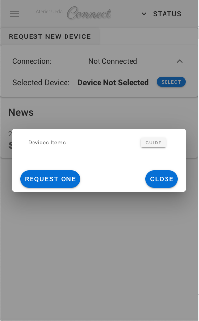

# Get started

## Sign in to the service

## Get DeviceID
## Install & setup

### 1. Get connect clinet
Log in on your Raspberry pi, get **connect client** as 

```bash:
git clone https://github.com/UedaTakeyuki/connectcli.git
```

or download lates zip or tarball of releases from [releases](https://github.com/UedaTakeyuki/connectcli/releases/) and expand it.

### 2. Run setup.sh script
Go into "connectcli" folder created by **git clone** or "connectcli.xx.yy.zz" folder downloaded and expanded from [releases](https://github.com/UedaTakeyuki/connectcli/releases/) and expand it.

```bash:
# in case git clone
cd connectcli

# or download and expand it
cd connectcli.xx.yy.zz
```

Then run ``setup.sh `` script

```bash
./setup.sh
```

This script downloads the appropriate version of the application **connect client** and makes an appropriate .service file of the unit definition of Linux service. 

### 3. Get deviceID

Log in or sign in to [Connect](https://connect.uedasoft.com/) service in your browser. You will see something like following:


Click on the "V" shaped dropdown menu icon on the far right of the middle row indicated  "Connection: Not Connected". The meaning of "Connection: Not Connected" will be explained in detail later.